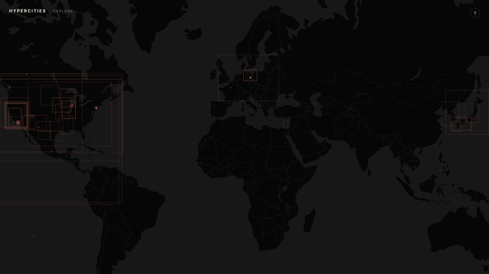
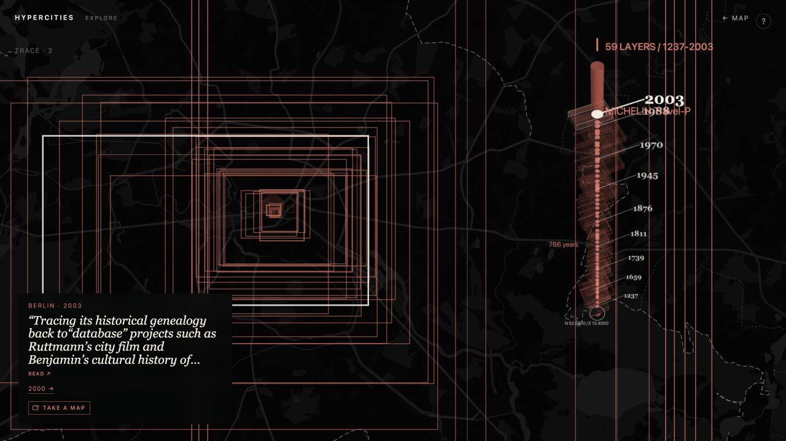

# HyperCities

A static research prototype for experiencing *HyperCities: Thick Mapping in the Digital Humanities* through historical maps, time, and a source-grounded Hyperbook.

This is not a recreation of the original GIS platform or a conventional academic website. It is an experiment in the HyperCities proposition: a visitor can enter a place, descend through its cartographic past, and encounter ideas, voices, and source pages that the movement itself evokes.

## The current build

- A dark, label-free world map reveals the real extents of historical maps as restrained red traces.
- The map remains the landing experience. A quiet **EXPLORE** opens a sparse constellation of HyperCities entrances and lays down a different dashed dérive toward one possible future path each time; MAP, READ, and Take a Map are active now, while Windows and Origins remain visibly staged as later phases.
- **TAKE A MAP** is an archival action available whenever a historical layer is selected; Explore remains an optional archive-led entrance. Its floating source panel has three focused tabs—an interactive MapLibre map and complete HTML recipe, Google Earth/KML instructions, and QGIS instructions. It never implies a raster download or rights grant.
- Hovering a location with overlapping maps previews a **TimeWell**; clicking locks a CORE at that coordinate.
- The **TimeWell** is this prototype's temporal-CORE innovation: a floating three-dimensional cross-section generated when a visitor cuts into a location. Its strata preserve each map's geographic aspect ratio, a central pillar fixes the drilled coordinate, and the vertical axis makes the available dates traversable.
- Selecting a layer moves the map to that historical map's actual geographic extent and attempts to display its original raster tiles. The map remains freely pannable and zoomable.
- The full-book Hyperbook supplies encounters through direct place evidence, cartographic and temporal resonance, visitor actions, concepts, and deliberately labelled editorial routes. It may also remain silent.
- **READ** opens the book as a 212-page facsimile. Its visible Previous/Next controls and Left/Right keys turn pages. A quotation or title opens this same reader at its cited page; an exact quotation locator is highlighted when one is available.
- The **TRACE** holds a fading record of the current dérive. Arrow keys mirror the offered movements: Up/Down move through time, Right accepts a lateral route, and Left/Esc returns toward the map. In the book reader, Left/Right instead turn pages.

## Screens

### 1. The map field

Historical-map extents remain quiet until a visitor chooses a place to enter.



### 2. TimeWell: a temporal CORE

The TimeWell is not a timeline placed beside a map, nor a generic tilted map. It begins at the coordinate the visitor has cored. Its central cylinder holds that location while every available historical map clings to it as an actual, differently proportioned footprint: X/Y remains geographic extent; Z becomes historical position.

Older strata descend into the well; later maps rise toward the present. Large gaps are expanded enough to remain perceptible, while clusters of nearby dates stay traversable. Selecting a stratum moves the map itself to that map's real extent and, where available, loads its original raster tiles. The TimeWell therefore makes an excavation in place and time, rather than turning the archive into a sequence of cards.



### 3. Hyperbook encounters

A short source-grounded encounter may surface alongside a selected historical layer. The excerpt opens the appropriate page of the book in **READ**; the map remains the primary surface.

## Interaction grammar

1. Pan or zoom anywhere in the world map; choose EXPLORE to orient yourself without leaving it.
2. Choose **TAKE A MAP** in Explore to enter an archive-led route: core a place, select a layer, and open its map slip.
3. Hover over historical-map depth to preview a TimeWell; tap or click to cut a CORE.
4. Choose a stratum, a year, or use Up/Down to move across available maps in time.
5. Follow a named idea or accept a quiet lateral invitation; use TRACE to see where the dérive has passed.
6. Choose **READ** to move through the book page by page, or open a quotation/title to enter READ at its cited page. Esc, the close mark, or clicking outside returns to the map.

The `?` affordance in the prototype keeps this same grammar available without an onboarding sequence. Pointer and touch interactions remain primary; keyboard navigation is an optional echo.

## Hyperbook data

The prototype is backed by a reviewable, static full-book graph. The scholarly passage stays primary; encounter fragments are smaller source-grounded entrances into passages, quotations, concepts, people, projects, Windows, events, figures, and technical material.

| Artifact | Purpose |
| --- | --- |
| [hyperbook.json](data/hyperbook/hyperbook.json) | Book hierarchy and source objects |
| [entities.json](data/hyperbook/entities.json) | Controlled vocabulary and aliases |
| [edges.json](data/hyperbook/edges.json) | Explicit and carefully labelled inferred relationships |
| [encounters.json](data/hyperbook/encounters.json) | Encounter-sized source objects linked to their parent passages |
| [experience-affordances.json](data/hyperbook/experience-affordances.json) | Separate editorial proposals for future state-aware activation |
| [analysis.json](data/hyperbook/analysis.json) | Diversity, repetition, hubs, and human-review priorities |
| [derives.json](data/hyperbook/derives.json) | Auditable conceptual dérive simulations |
| [book-page locations](data/book-page-locations.json) | Page-local quotation locators for the reader |
| [book pages](assets/book-pages) | 212 WebP facsimiles from the supplied edition |

Current extraction totals: **56 passages**, **160 quotations**, **291 encounter fragments**, **138 controlled entities**, **1,481 source-graph edges**, and **1,850 editorial affordances**.

The data deliberately separates `book-explicit`, `book-inferred`, and `editorial` claims. Geographic activation is conservative: country-scale entities are never used as a spatial fallback, and the system can return no encounter rather than pretend a passage is about the current map. The narrow Japan thread is explicitly editorial and favors Yoh Kawano's Mapping Events / Tohoku / Fukushima material without claiming that every Japanese map depicts those places.

See the [full schema and editorial policy](docs/hyperbook-full-schema.md) and [four conceptual dérive tests](docs/hyperbook-derives.md) for the evidence model, safeguards, and review priorities.

## Static architecture

The prototype is designed to remain publishable from GitHub Pages:

- HTML, CSS, vanilla JavaScript ES modules, and static JSON
- MapLibre GL JS for the navigable basemap
- deck.gl for historical footprints and the TimeWell's three-dimensional layers
- no database, backend, authentication, framework, or build pipeline

Use GitHub Pages or any local static HTTP server for preview. Do not open `index.html` through `file://`: browsers isolate that origin and block the JSON data reads the prototype needs.

### Taking a map outward

Take a Map is a full floating panel rather than a small map-corner export menu. It separates three realistic routes into tabs and exposes only transfer paths that preserve what the collection actually supplies:

- **MapLibre**: a live, pan-and-zoom embed with a complete, copyable HTML page containing this map's XYZ template, geographic bounds, zoom range, and citation.
- **Google Earth / KML**: a downloaded Network-Link KML plus both routes into Google Earth Pro: `File → Open…` for the download, or `Add → Network Link…` with the supplied hosted KML URL. The KML draws the source XYZ tiles as geographic overlays at the recorded minimum zoom, then refreshes its hosted record hourly; MapLibre and QGIS retain the full interactive tile pyramid.
- **QGIS**: the exact XYZ template and steps to create a QGIS Browser-panel connection for the selected historical raster.

GeoJSON, generic map-record, and TileJSON downloads are intentionally not surfaced: by themselves they only expose an outline or a technical descriptor, not the historical map. Current source records do not establish uniform rights, CORS policy, full raster-download paths, or georeferencing control points, so the panel retains the source condition and asks users to verify the original collection's terms before making derivatives or overlays.

## Source and rebuild notes

The source edition is `eScholarship UC item 3mh5t455.pdf`. The committed graph covers printed pp. 6–203; its later apparatus remains source material but is not passage-extracted. Page images cover all 212 scanned pages.

The graph and facsimiles can be regenerated with the repository scripts:

```sh
mkdir -p tmp/hyperbook-extraction
pdftotext -raw "eScholarship UC item 3mh5t455.pdf" tmp/hyperbook-extraction/book-raw.txt
node scripts/build-hyperbook-full.mjs tmp/hyperbook-extraction/book-raw.txt
node scripts/validate-hyperbook-full.mjs tmp/hyperbook-extraction/book-raw.txt
node scripts/simulate-hyperbook-derives.mjs
node scripts/build-book-page-assets.mjs
```

`tmp/` contains local extraction intermediates and is intentionally not a source of runtime behavior.
