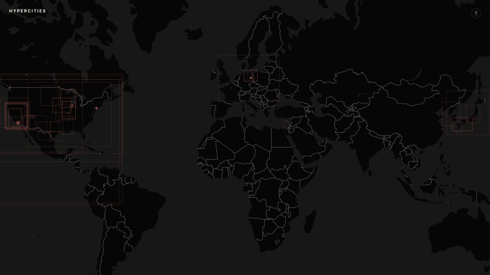
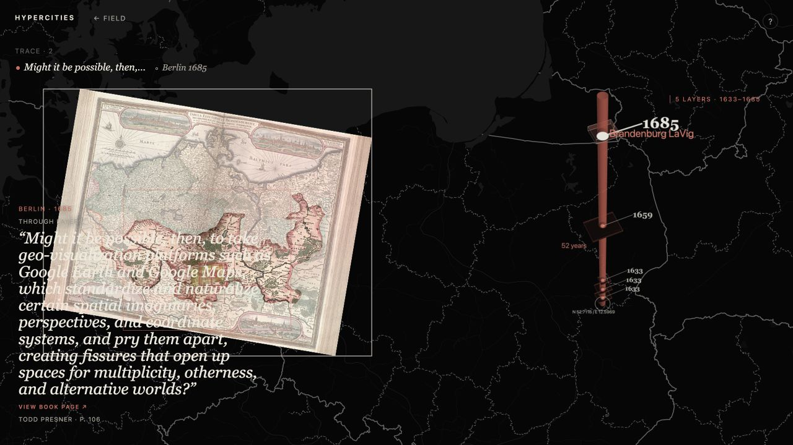
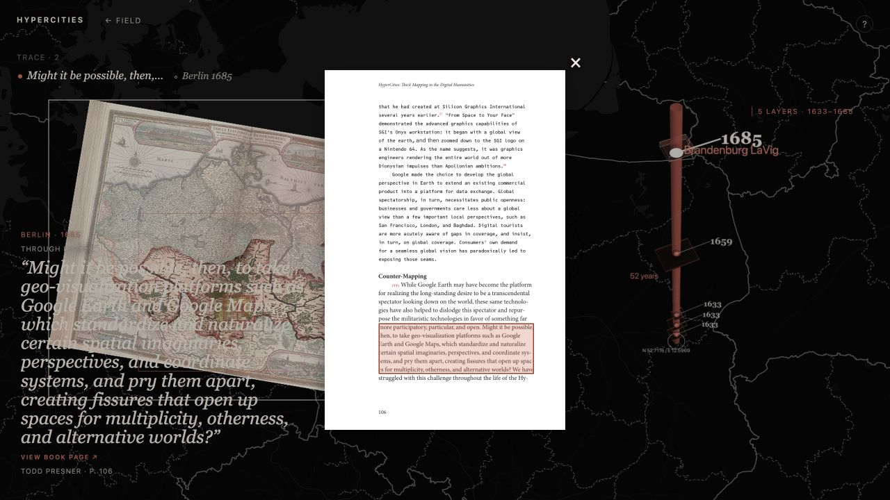

# HyperCities

A static research prototype for experiencing *HyperCities: Thick Mapping in the Digital Humanities* through historical maps, time, and a source-grounded Hyperbook.

This is not a recreation of the original GIS platform or a conventional academic website. It is an experiment in the HyperCities proposition: a visitor can enter a place, descend through its cartographic past, and encounter ideas, voices, and source pages that the movement itself evokes.

## The current build

- A dark, label-free world field reveals the real extents of historical maps as restrained red traces.
- Hovering a location with overlapping maps previews a **TimeWell**; clicking locks a CORE at that coordinate.
- The TimeWell is a floating three-dimensional temporal cross-section. Its strata preserve each map's geographic aspect ratio, while a central pillar marks the drilled coordinate and the vertical axis names the available years.
- Selecting a layer moves the map to that historical map's actual geographic extent and attempts to display its original raster tiles. The map remains freely pannable and zoomable.
- The full-book Hyperbook supplies encounters through direct place evidence, cartographic and temporal resonance, visitor actions, concepts, and deliberately labelled editorial routes. It may also remain silent.
- Clicking a quotation opens its scanned source page with the source passage highlighted. Left and Right arrows page through all 212 source images; returning to the cited page restores the highlight.
- The **TRACE** holds a fading record of the current dérive. Arrow keys mirror the offered movements: Up/Down move through time, Right accepts a lateral route, and Left/Esc returns toward the field. In the book reader, Left/Right instead turn pages.

## Screens

### 1. The world field

Historical-map extents remain quiet until a visitor chooses a place to enter.



### 2. A TimeWell / CORE in Berlin

A selected historical raster occupies its true geographic footprint on the map while the TimeWell keeps the place's available dates and layers visible to the right.



### 3. The Hyperbook as a source encounter

A quotation opens the original book page as a floating facsimile. The tinted mark is a locator, not a replacement for the source text.



## Interaction grammar

1. Pan or zoom anywhere in the world field.
2. Hover over historical-map depth to preview a TimeWell; tap or click to cut a CORE.
3. Choose a stratum, a year, or use Up/Down to move across available maps in time.
4. Follow a named idea or accept a quiet lateral invitation; use TRACE to see where the dérive has passed.
5. Open a quotation to inspect the book page. Esc, the close mark, or clicking outside returns to the map.

The `?` affordance in the prototype keeps this same grammar available without an onboarding sequence. Pointer and touch interactions remain primary; keyboard navigation is an optional echo.

## Hyperbook data

The prototype is backed by a reviewable, static full-book graph. The scholarly passage stays primary; encounter fragments are smaller source-grounded entrances into passages, quotations, concepts, people, projects, Windows, events, figures, and technical material.

| Artifact | Purpose |
| --- | --- |
| [hyperbook.json](data/hyperbook/hyperbook.json) | Book hierarchy and source objects |
| [entities.json](data/hyperbook/entities.json) | Controlled vocabulary and aliases |
| [edges.json](data/hyperbook/edges.json) | Explicit and carefully labelled inferred relationships |
| [encounters.json](data/hyperbook/encounters.json) | Encounter-sized source objects linked to their parent passages |
| [experience-affordances.json](data/hyperbook/experience-affordances.json) | Separate editorial proposals for future state-aware activation |
| [analysis.json](data/hyperbook/analysis.json) | Diversity, repetition, hubs, and human-review priorities |
| [derives.json](data/hyperbook/derives.json) | Auditable conceptual dérive simulations |
| [book-page locations](data/book-page-locations.json) | Page-local quotation locators for the reader |
| [book pages](assets/book-pages) | 212 WebP facsimiles from the supplied edition |

Current extraction totals: **56 passages**, **160 quotations**, **291 encounter fragments**, **138 controlled entities**, **1,481 source-graph edges**, and **1,850 editorial affordances**.

The data deliberately separates `book-explicit`, `book-inferred`, and `editorial` claims. Geographic activation is conservative: country-scale entities are never used as a spatial fallback, and the system can return no encounter rather than pretend a passage is about the current map. The narrow Japan thread is explicitly editorial and favors Yoh Kawano's Mapping Events / Tohoku / Fukushima material without claiming that every Japanese map depicts those places.

See the [full schema and editorial policy](docs/hyperbook-full-schema.md) and [four conceptual dérive tests](docs/hyperbook-derives.md) for the evidence model, safeguards, and review priorities.

## Static architecture

The prototype is designed to remain publishable from GitHub Pages:

- HTML, CSS, vanilla JavaScript ES modules, and static JSON
- MapLibre GL JS for the navigable basemap
- deck.gl for historical footprints and the TimeWell's three-dimensional layers
- no database, backend, authentication, framework, or build pipeline

Use GitHub Pages or any local static HTTP server for preview. Do not open `index.html` through `file://`: browsers isolate that origin and block the JSON data reads the prototype needs.

## Source and rebuild notes

The source edition is `eScholarship UC item 3mh5t455.pdf`. The committed graph covers printed pp. 6–203; its later apparatus remains source material but is not passage-extracted. Page images cover all 212 scanned pages.

The graph and facsimiles can be regenerated with the repository scripts:

```sh
mkdir -p tmp/hyperbook-extraction
pdftotext -raw "eScholarship UC item 3mh5t455.pdf" tmp/hyperbook-extraction/book-raw.txt
node scripts/build-hyperbook-full.mjs tmp/hyperbook-extraction/book-raw.txt
node scripts/validate-hyperbook-full.mjs tmp/hyperbook-extraction/book-raw.txt
node scripts/simulate-hyperbook-derives.mjs
node scripts/build-book-page-assets.mjs
```

`tmp/` contains local extraction intermediates and is intentionally not a source of runtime behavior.
